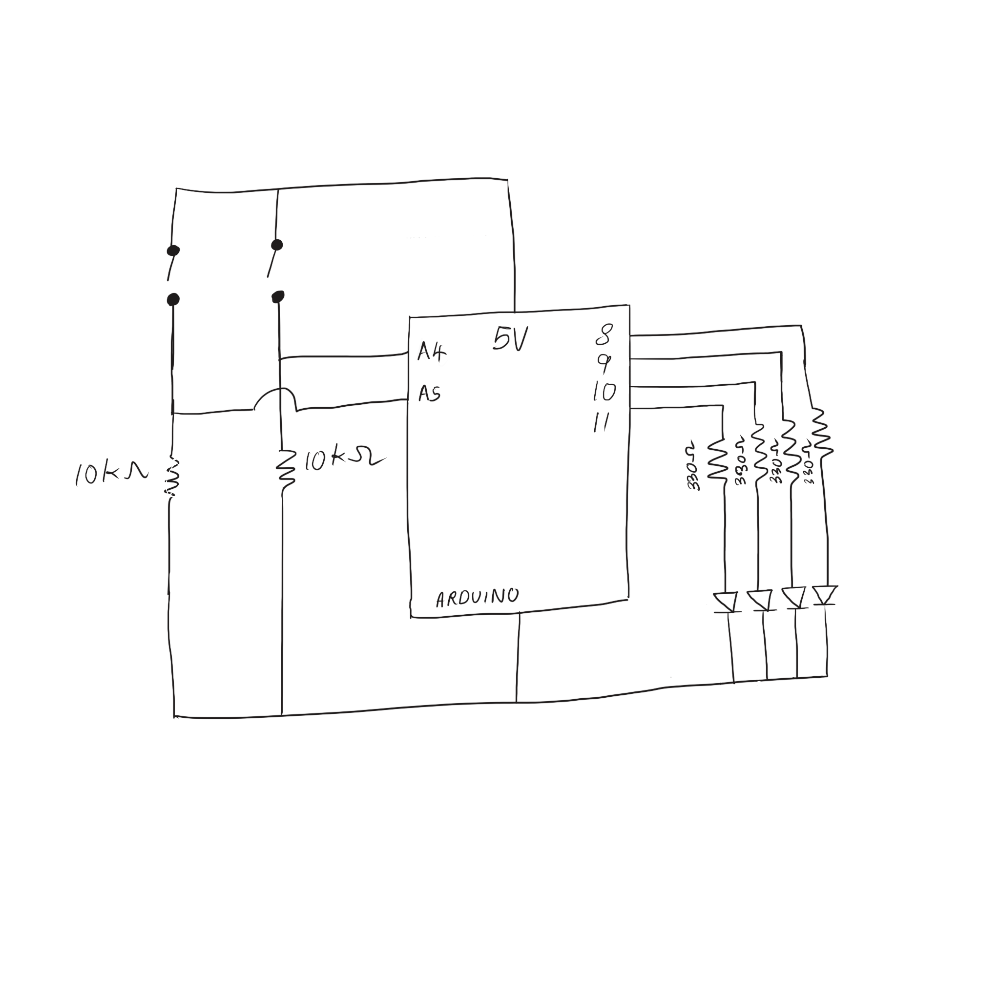

## Light Up LEDs

In this first Arduino project, I created a circuit with two switches that do the following, respectively, when clicked one at a time:
* the four different-colored LEDs light up one at a time 
* the LEDs light up randomly

Here is the youtube link for a video: https://youtu.be/fcAhzDUEdo8

The main problem I ran into was knowing what to connect to what in order to obtain my desired result. This was solved by rewatching all the lectures and watching youtube videos to get  comfortable with pinning things down to the breadboard and uploading code. The other main problem I faced was actually translating the circuit on the breadboard to a clean schematic, which was also eventually achieved, as shown below. This process also made me realize that my circuit was unnecessarily complicated, so I simplified it, making translating it to its schematic much easier. 

