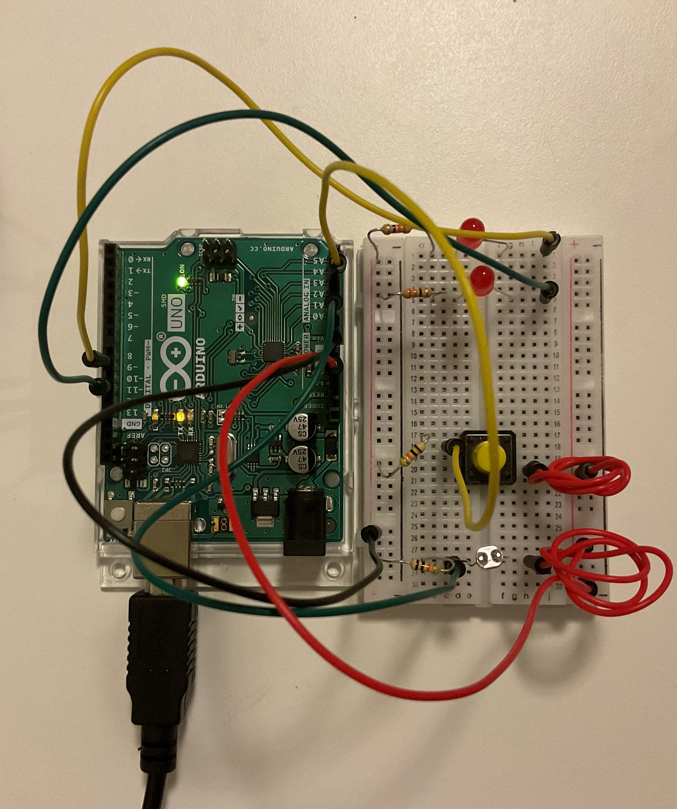

### Light Up with LDR

Below is a photograph of the final circuit, and here is the link to the video: https://youtu.be/0u97dRXpkq4

  
The goal of this project was to read input from a light-dependent resister and a switch and use that information to control one LED each. I used the LDR input such that when the light hitting it is above a certain threshold, it would blink fast -- and when the amount of light falls within a certain range, it would blink slower. In the case of the switch, I simply set it such that when the switch was pushed, it would result in the other LED blinking. This was supposed to be a simple implementation. 

However, something doesn't work. Sometimes, when I click on the switch, it doesn't result in the second LED blinking. After much futile debugging, I am  (for now) sticking with it just turning on -- which seems to work most of the time. The weird thing is, when I comment out the code that results in the other LDR-connected LED blinking, the other LED seems to work just fine. 

The circuit is fairly simple. It took a lot of time because apart from the above-mentioned problem, I had accidentally coded the LEDs as inputs, instead of outputs -- and thus I was observing very dim light. I also ended up using some burnt LEDs from last time -- which I didn't realize so I wasted time taking apart my circuit and putting it together, testing out different LED colors, and replacing wires several times before actually taking a look at my code and the LEDs.

