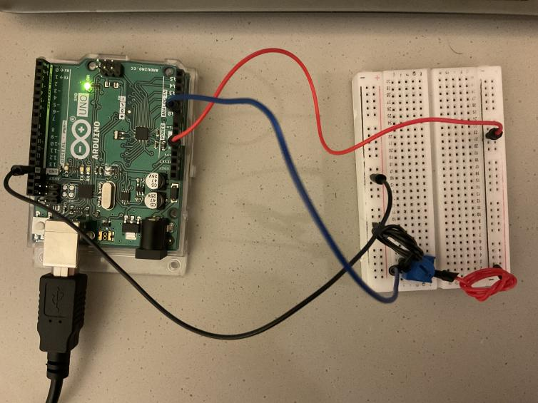
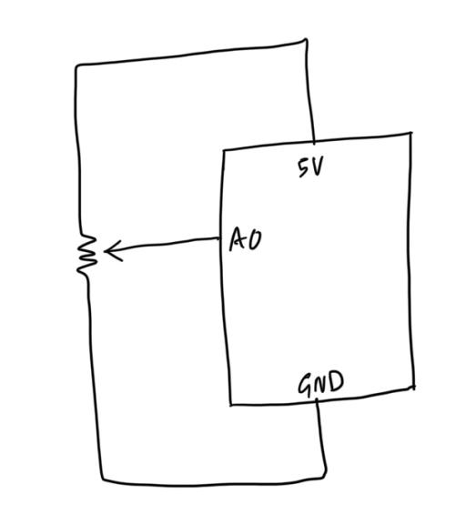

### Move the Circles

#### Prompt: Make a simple game that involves some kind of communication between Arduino and Processing. Always use handshaking.

In this project, the goal was to create something that involved some kind of communication between Arduino and Processing.

I utilized a class I had coded for a previous project. This class creates concentric circles of varying colors at a specified location. Now here, I used incoming data from a potentiometer to specify the x-coordinate of this concentric circle set, while keeping its y-coordinate constant. In order to conduct handshaking, I created a variable called `receivingIndicator` in Arduino and a boolean called `arduinoReceives` in Processing -- as long as the latter was `true`, data would be sent to Arduino -- and as long as the Arduino program received data, it would Serial print the potentiometer data.

I ended up making a lot of stupid mistakes while trying to get this to work. These included: 
* commenting out the part in Processing that sends data to Arduino and forgetting that the Arduino program depends on receiving data from Processing. 
* making some variables local variables and not realizing why they weren't working

I became very cautious after that. Every time I needed to check something, I would only comment out a bit of something and re-run Arduino and Processing. I also resorted to printing a lot of things, just to be sure I was doing the right thing. 

Here is a link to see how it works: https://youtu.be/AHa17KsNS3g

A screenshot of the final result is shown below.

  

Here is an image of the circuit, and below it is the schematic.

  

  

