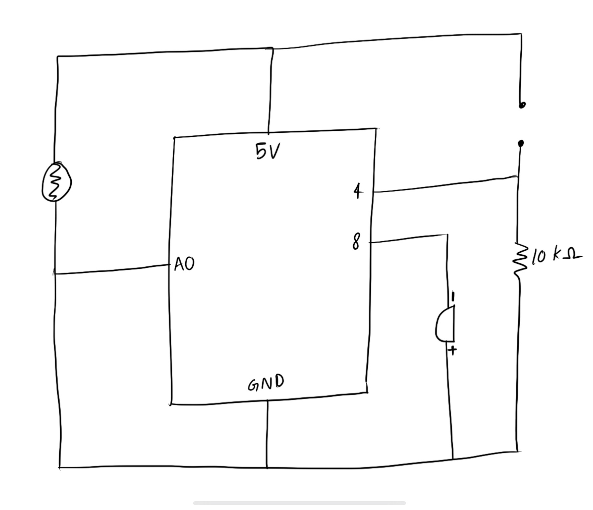

### Musical Circuit

In this project, the goal was to create a musical insturment using a push button (switch), a potentiometer and a piezo buzzer. I used these components with the following functionality:

* push button: turn sound off / on
* potentiometer: change note according to rotation
* piezo buzzer: play sound

The circuit used for this is shown below, and here is the video: https://youtu.be/JuTdTbAq_B0

  

  

